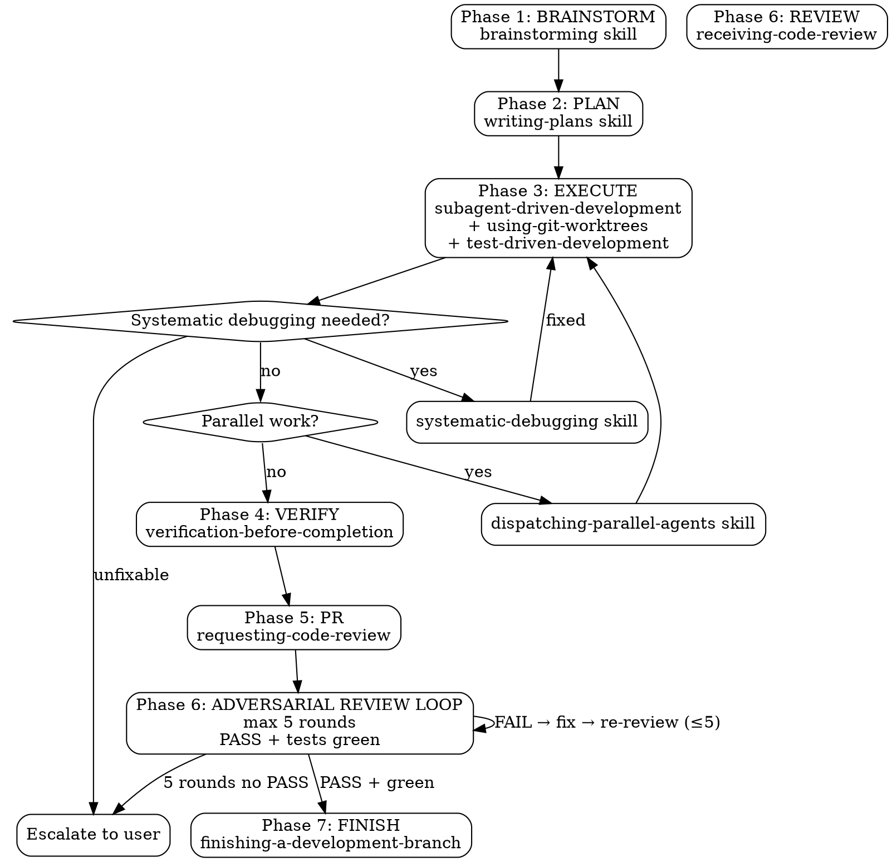

# Oneshot Pipeline

Autonomous end-to-end SDLC: task → spec → plan → implementation → verification → PR → merge.

**Core principle:** Full autonomy once started. No pauses between phases. User consulted only at design approval, plan approval, and final branch decision.

**Announce at start:** "Oneshot pipeline starting for: [task description]"

**Context hygiene:** This skill is subagent-driven. Main session orchestrates phases 1-2-4-5-6-7 directly (need user interaction), but Phase 3 EXECUTE is fully delegated to subagents via `task` tool. Main never writes implementation code inline.

---

## Pipeline Overview



Run phases sequentially 1→7. No skipping. Validate prior phase artifact exists before proceeding.

---

## Phase 1: BRAINSTORM

**Output:** `docs/superpowers/specs/YYYY-MM-DD-<topic>-design.md`

### ⚠️ MANDATORY: Load Brainstorming Skill

**You MUST invoke the `brainstorming` skill via the `skill` tool now.** It provides checklist for design exploration, requirements gathering, architecture decisions. Without it you will miss required steps.

After loading, follow DESIGN checklist it provides. Includes:
- Understanding user needs
- Exploring architecture options
- Documenting design decisions
- Getting user approval before writing spec

### Execution

1. Follow brainstorming skill checklist exactly
2. Present design to user, get approval
3. Write spec to `docs/superpowers/specs/YYYY-MM-DD-<topic>-design.md`
4. Commit spec: `git add docs/superpowers/specs/ && git commit -m "docs: spec for [topic]"`
5. Proceed to Phase 2

---

## Phase 2: PLAN

**Output:** `docs/superpowers/plans/YYYY-MM-DD-<feature-name>.md`

### ⚠️ MANDATORY: Load Writing-Plans Skill

**You MUST invoke the `writing-plans` skill via the `skill` tool now.** It contains decomposition checklist for breaking specs into executable tasks with file paths, dependencies, effort estimates. Without it plan will be unstructured.

### Execution

1. Follow writing-plans skill checklist exactly
2. Save plan to `docs/superpowers/plans/YYYY-MM-DD-<feature-name>.md`, commit
3. Execution mode is **Subagent-Driven Development only** (keeps main context clean). Do NOT offer inline execution.
4. Proceed to Phase 3

---

## Phase 3: EXECUTE

**Sub-skills:** `using-git-worktrees`, `test-driven-development`
**Error routing:** `systematic-debugging`

### ⚠️ MANDATORY: Load Execution Skills

You MUST invoke via `skill` tool:
- `subagent-driven-development` — dispatch pattern, keeps main context clean
- `using-git-worktrees` — isolated workspace per task
- `test-driven-development` — TDD workflow

All three are required. No inline execution path.

### Execution (subagent-driven, context-clean)

1. Invoke `using-git-worktrees` to set up isolated workspace/branch
2. For each task in plan: dispatch via `task` tool as fresh subagent (type: general or explore as needed)
3. Each subagent follows TDD: write failing test → implement → pass
4. Two-stage review after each task completes
5. Main session only orchestrates — no direct code writes in main context
6. If plan has independent sub-tasks: also invoke `dispatching-parallel-agents` for parallel dispatch

**Error routing:** If any task fails:
- Route to `systematic-debugging` skill
- Fix root cause, re-run task
- If unfixable: escalate to user with failure context

**Parallel work:** If plan has independent sub-tasks, invoke `dispatching-parallel-agents` skill.

---

## Phase 4: VERIFY

**Skill:** `verification-before-completion`

### ⚠️ MANDATORY: Load Verification Skill

**You MUST invoke the `verification-before-completion` skill via the `skill` tool now.** It provides verification checklist and 30-second reality check framework.

### Execution

1. Run test suite. If none exists, check project docs for test command.
2. Run lint (`npm run lint`, `ruff`, etc.)
3. Run typecheck (`npm run typecheck`, `mypy`, etc.)
4. Run build (`npm run build`, etc.)
5. Cross-check implementation against spec requirements
6. Fix any failures — do NOT proceed with failures

---

## Phase 5: PR

**Skill:** `requesting-code-review`

### ⚠️ MANDATORY: Load PR Skill

**You MUST invoke the `requesting-code-review` skill via the `skill` tool now.** It provides pre-merge checklist and PR template.

### Execution

1. Push branch to remote
2. Create PR with summary, test plan, linked spec
3. Save PR URL
4. Request review from configured reviewers

---

## Phase 6: ADVERSARIAL REVIEW LOOP (max 5 rounds)

**Skills:** `receiving-code-review` + `cavecrew-reviewer` (or `caveman-review`) + `verification-before-completion` (tests) + `systematic-debugging` on failure
**Gate to Phase 7:** `REVIEW == PASS` **AND** `tests == green` (if tests exist). Both required.
**Loop cap:** 5 rounds. No proceed on FAIL or red tests.

### ⚠️ MANDATORY: Load Review Skills

You MUST invoke via `skill` tool:
- `receiving-code-review` — rigor over performative agreement
- `cavecrew-reviewer` / `caveman-review` — adversarial one-line findings format (optional but recommended for reviewer subagent prompt)

### Adversarial Reviewer Stance

Reviewer subagent assumes code is broken. Must try to find bugs, not confirm quality. Instructions for reviewer subagent:

> You are adversarial reviewer. Assume implementation has bugs. Check: spec compliance, edge cases, error handling, security, performance, test coverage, diff vs plan, hidden regressions. Output `PASS` only if zero blocking issues. Otherwise `FAIL` + findings as `path:line: 🔴 bug: ...` / `🟡 risk: ...` + concrete fix. Be strict.

### Execution — Loop (≤5 rounds)

```
round = 1..5:
  1. Dispatch reviewer subagent via `task` tool (fresh context, reads spec + plan + diff + runs tests if present)
     Reviewer outputs: PASS or FAIL + findings, plus tests status (green/red/ no-tests)
  2. Run verification: `tests` (if existent) must be green. `lint`/`typecheck`/`build` if applicable. Record result.
  3. Decision:
     - if PASS && tests green (or no tests but reviewer PASS + build green) → break loop, proceed to Phase 7
     - if FAIL or tests red → dispatch fix subagent(s) via `task` (type: general/cavecrew-builder, 1-2 files max per subagent) to address ALL findings, push fix, round++
  4. If round == 5 and still FAIL/red → escalate to user with: round count, last review findings, test output, diff summary. Do NOT proceed to Phase 7. Await user decision (force-merge / more fixes / discard).
```

### Rules

- Each round uses fresh subagents: reviewer never fixes, fixer never reviews (separation of concerns).
- Fixer must run tests before declaring done; main verifies green.
- No skipping rounds. No early FINISH on FAIL.
- If no test suite exists: reviewer PASS + build/lint green suffices, but reviewer must flag `no tests` as 🟡 risk.
- Max 5 rounds enforced — 6th round is escalation, not auto-loop.

### Opencode Loop Support

Opencode has no native adversarial-review-loop primitive. Supported via composition:
- Loop plugin `/loop --max-iterations 5` auto-re-prompt on `<promise>DONE</promise>` — usable but not review-specific.
- Preferred here: manual `task` loop in main session (above) — keeps review history in main context, no plugin state file needed, works with `subagent-driven-development`.
- If you want autonomous `/loop` variant: run `/loop adversarial review PR --max-iterations 5` and make reviewer emit `<promise>DONE</promise>` only on PASS+green. Both patterns valid; this skill uses manual loop for determinism.


---

## Phase 7: FINISH

**Skill:** `finishing-a-development-branch`

### ⚠️ MANDATORY: Load Finish Skill

**You MUST invoke the `finishing-a-development-branch` skill via the `skill` tool now.** It provides merge decision framework.

### Execution

1. Verify tests pass on final state
2. Present merge options to user:
   - Option 1: Merge locally
   - Option 2: PR already created (provide URL)
   - Option 3: Keep branch as-is
   - Option 4: Discard
3. Execute user choice

On completion: `memory add "oneshot completed: [task] on [branch]"`

---

## Error Handling

| Symptom | Route | Action |
|---------|-------|--------|
| Task fails during execution | systematic-debugging | Find root cause, fix, retry |
| Unfixable bug | User escalation | Report phase + error + context |
| Reviewer FAIL (rounds ≤5) | adversarial review loop | Fix subagent → re-review, repeat ≤5 |
| Spec incomplete | Back to Phase 1 | Fix gaps, re-approve |
| Plan has gaps | writing-plans | Add missing tasks inline |
| User interrupts | Resume from artifacts | Resume from last completed phase artifact |

## Red Flags

**Never:**
- Skip phases (all 7 required)
- Proceed without loading phase required skill(s)
- Proceed without user approval on design and plan
- Merge without verification
- Skip test-driven development
- Ignore verification failures
- Continue past unfixable error without user escalation
- Proceed to FINISH on FAIL review or red tests
- Exceed 5 review rounds without escalation

**Always:**
- Load every required skill via `skill` tool
- Validate prior phase artifact exists before next phase
- Verify before claiming completion
- Escalate after 5 failed review rounds
- Escalate unfixable issues
- Present structured choices to user

## Key Principles

- **Full autonomy:** Execute all phases without pausing between them
- **Artifact-based resume:** Prior phase artifacts (spec/plan) are truth for resume
- **Error-hardened:** Route problems to systematic-debugging before escalating
- **User consulted at 3 gates only:** design, plan choice, final branch decision
- **Subagents for implementation:** fresh context per task, no pollution — main session stays lean
- **Context-clean guarantee:** All code execution via `task` subagents; main only holds spec/plan/PR state
- **TDD always:** subagents write failing test before production code
- **Adversarial review gate:** FINISH only on PASS + green tests, max 5 rounds, reviewer ≠ fixer
