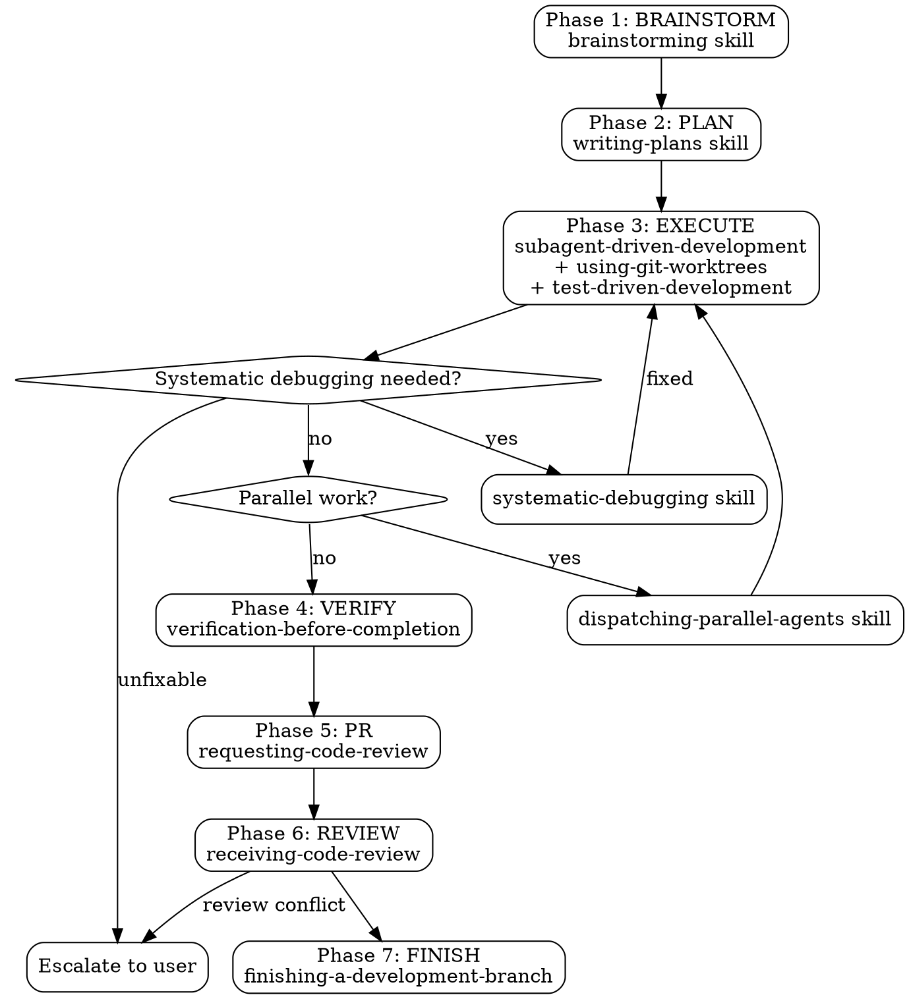

# Oneshot Pipeline

Autonomous end-to-end SDLC: task → spec → plan → implementation → verification → PR → merge.

**Core principle:** Full autonomy once started. No pauses between phases. User consulted only at design approval, plan approval, and final branch decision. State tracked via git tags — NOT memory.

**Announce at start:** "Oneshot pipeline starting for: [task description]"

---

## ⚠️ BOOT INTEGRITY CHECK — Run This First

**Do NOT skip. Do NOT trust memory. Only git tags and filesystem state are authoritative.**

```bash
# Find latest completed phase from git tags
last_tag=$(git tag -l 'oneshot/phase-*' 2>/dev/null | sort -t- -k3 -n | tail -1)
if [ -n "$last_tag" ]; then
  last_phase=${last_tag##*-}
  echo "Last verified phase: $last_phase"
  # Verify all prior phase artifacts
  for p in $(seq 1 "$last_phase"); do
    if ! git tag -l "oneshot/phase-$p" | grep -q .; then
      echo "ERROR: Gap at phase $p — tag $last_tag exists but phase $p tag missing"
      echo "State corrupted. Starting fresh."
      last_phase=0
      break
    fi
  done
  # Verify phase-required artifacts
  case "$last_phase" in
    1) test -f "$(ls -t docs/superpowers/specs/*.md 2>/dev/null | head -1)" 2>/dev/null || {
         echo "ERROR: Phase 1 tag exists but no spec file"
         echo "State corrupted. Starting fresh."
         last_phase=0
       } ;;
    2) test -f "$(ls -t docs/superpowers/plans/*.md 2>/dev/null | head -1)" 2>/dev/null || {
         echo "ERROR: Phase 2 tag exists but no plan file"
         echo "State corrupted. Starting fresh."
         last_phase=0
       } ;;
  esac
  CURRENT_PHASE=$((last_phase + 1))
else
  CURRENT_PHASE=1
fi

echo "Starting from Phase $CURRENT_PHASE"
echo "ONESHOT_PHASE=$CURRENT_PHASE" > .oneshot-state
```

If this check resets to fresh start, surface it: "Pipeline state corrupted — restarting from Phase 1."

---

## Pipeline Overview



## State Tracking (NOT negotiable)

Pipeline state is tracked by git tags. Memory is NOT authoritative.

**Rules:**
- Each completed phase creates tag `oneshot/phase-N` with date + description
- `.oneshot-state` file in project root caches current phase (local, gitignored)
- On resume: boot check reads tags, NOT memory
- If tags and artifacts conflict: roll back to last verified state

**`.gitignore` entry (run once):**
```bash
echo ".oneshot-state" >> .gitignore
```

---

## Phase 1: BRAINSTORM

**Output:** `docs/superpowers/specs/YYYY-MM-DD-<topic>-design.md`

### Entry Gate

```bash
# Verify we have no gap. Should be Phase 1 or skip-approved.
source .oneshot-state 2>/dev/null || CURRENT_PHASE=1
if [ "$CURRENT_PHASE" -gt 2 ]; then
  echo "Phase 1 already completed (tag: $(git tag -l 'oneshot/phase-1')). Skipping..."
  exit 0
fi
# Check skip condition
spec_file=$(ls -t docs/superpowers/specs/*.md 2>/dev/null | head -1)
if [ -n "$spec_file" ] && git tag -l 'oneshot/phase-1' | grep -q .; then
  echo "Phase 1 artifacts verified. Skipping..."
  exit 0
fi
```

### ⚠️ MANDATORY: Load Brainstorming Skill

**You MUST invoke the `brainstorming` skill via the `skill` tool now.** It provides the checklist for design exploration, requirements gathering, and architecture decisions. Without its content in context, you will miss required steps.

After loading it, follow the DESIGN checklist it provides. This includes:
- Understanding user needs
- Exploring architecture options
- Documenting design decisions
- Getting user approval before writing the spec

### Execution

1. Follow brainstorming skill's checklist exactly
2. Present design to user, get approval
3. Write spec to `docs/superpowers/specs/YYYY-MM-DD-<topic>-design.md`
4. Commit spec: `git add docs/superpowers/specs/ && git commit -m "docs: spec for [topic]"`
5. **Do NOT pause** — proceed to Exit Gate

### Exit Gate

```bash
spec_file=$(ls -t docs/superpowers/specs/*.md 2>/dev/null | head -1)
if [ -z "$spec_file" ]; then
  echo "FATAL: No spec file found in docs/superpowers/specs/"
  echo "Phase 1 incomplete. Cannot proceed."
  exit 1
fi
echo "ONESHOT_PHASE=2" > .oneshot-state
git tag -f "oneshot/phase-1" -m "BRAINSTORM complete: $spec_file"
echo "Phase 1 complete. Tag: oneshot/phase-1"
```

Automatically proceed to Phase 2.

---

## Phase 2: PLAN

**Output:** `docs/superpowers/plans/YYYY-MM-DD-<feature-name>.md`

### Entry Gate

```bash
source .oneshot-state 2>/dev/null || CURRENT_PHASE=1
if [ "$CURRENT_PHASE" -lt 2 ]; then
  echo "ERROR: Phase 2 entry gate failed. Phase 1 not complete."
  echo "Run boot integrity check and complete Phase 1 first."
  exit 1
fi
if [ "$CURRENT_PHASE" -gt 3 ]; then
  echo "Phase 2 already completed. Skipping..."
  exit 0
fi
if ! git tag -l 'oneshot/phase-2' | grep -q .; then
  # Verify Phase 1 artifacts are solid
  spec_file=$(ls -t docs/superpowers/specs/*.md 2>/dev/null | head -1)
  if [ -z "$spec_file" ]; then
    echo "ERROR: Phase 1 claimed complete but no spec file found. Run boot check."
    exit 1
  fi
fi
```

### ⚠️ MANDATORY: Load Writing-Plans Skill

**You MUST invoke the `writing-plans` skill via the `skill` tool now.** It contains the decomposition checklist for breaking specs into executable tasks with file paths, dependencies, and effort estimates. Without it, the plan will be unstructured.

After loading, follow its checklist to produce a plan document.

### Execution

1. Follow writing-plans skill's checklist exactly
2. Save plan to `docs/superpowers/plans/YYYY-MM-DD-<feature-name>.md`, commit
3. Present execution options to user:
   - Option 1 (recommended): Subagent-Driven Development
   - Option 2: Inline execution
4. After user chooses → proceed to Exit Gate

### Exit Gate

```bash
plan_file=$(ls -t docs/superpowers/plans/*.md 2>/dev/null | head -1)
if [ -z "$plan_file" ]; then
  echo "FATAL: No plan file found in docs/superpowers/plans/"
  echo "Phase 2 incomplete. Cannot proceed."
  exit 1
fi
echo "ONESHOT_PHASE=3" > .oneshot-state
git tag -f "oneshot/phase-2" -m "PLAN complete: $plan_file"
echo "Phase 2 complete. Tag: oneshot/phase-2"
```

---

## Phase 3: EXECUTE

**Sub-skills:** `using-git-worktrees`, `test-driven-development`
**Error routing:** `systematic-debugging`

### Entry Gate

```bash
source .oneshot-state 2>/dev/null || CURRENT_PHASE=1
if [ "$CURRENT_PHASE" -lt 3 ]; then
  echo "ERROR: Phase 3 entry gate failed. Phase 2 not complete."
  exit 1
fi
if [ "$CURRENT_PHASE" -gt 4 ]; then
  echo "Phase 3 already completed. Skipping..."
  exit 0
fi
if ! git tag -l 'oneshot/phase-2' | grep -q .; then
  echo "ERROR: Phase 3 entry gate failed — no oneshot/phase-2 tag."
  exit 1
fi
plan_file=$(ls -t docs/superpowers/plans/*.md 2>/dev/null | head -1)
if [ -z "$plan_file" ]; then
  echo "ERROR: Phase 2 tag exists but no plan file. State corrupted."
  exit 1
fi
```

### ⚠️ MANDATORY: Load Execution Skills

Based on user's choice from Phase 2:

- **Subagent-Driven Development** chosen: invoke `subagent-driven-development` skill
- **Inline execution** chosen: invoke `executing-plans` skill

**Additionally, you MUST invoke:**
- `using-git-worktrees` — sets up isolated workspace
- `test-driven-development` — guides TDD workflow

Load these via the `skill` tool now. Each adds required checklists.

### Execution

If user chose Subagent-Driven Development:
1. Invoke `using-git-worktrees` to set up isolated workspace
2. Dispatch each task from the plan as a fresh subagent
3. Two-stage review after each task completes
4. All subagents MUST follow TDD (test before code)

If user chose Inline Execution:
1. Batch tasks with checkpoints
2. Use TDD for all implementation

**Error routing:** If any task fails:
- Route to `systematic-debugging` skill
- Fix root cause, re-run task
- If unfixable: escalate to user with failure context

**Parallel work:** If plan has independent sub-tasks, invoke `dispatching-parallel-agents` skill.

### Exit Gate

```bash
# Verify implementation matches plan
echo "Verifying implementation against plan..."
plan_file=$(ls -t docs/superpowers/plans/*.md 2>/dev/null | head -1)
echo "Plan: $plan_file"
echo "Branch: $(git branch --show-current)"
# Note: detailed verification happens in Phase 4
echo "ONESHOT_PHASE=4" > .oneshot-state
git tag -f "oneshot/phase-3" -m "EXECUTE complete"
echo "Phase 3 complete. Tag: oneshot/phase-3"
```

---

## Phase 4: VERIFY

**Skill:** `verification-before-completion`

### Entry Gate

```bash
source .oneshot-state 2>/dev/null || CURRENT_PHASE=1
if [ "$CURRENT_PHASE" -lt 4 ]; then
  echo "ERROR: Phase 4 entry gate failed. Phase 3 not complete."
  exit 1
fi
if [ "$CURRENT_PHASE" -gt 5 ]; then
  echo "Phase 4 already completed. Skipping..."
  exit 0
fi
if ! git tag -l 'oneshot/phase-3' | grep -q .; then
  echo "ERROR: Phase 4 entry gate failed — no oneshot/phase-3 tag."
  exit 1
fi
```

### ⚠️ MANDATORY: Load Verification Skill

**You MUST invoke the `verification-before-completion` skill via the `skill` tool now.** It provides the verification checklist and the 30-second reality check framework. Without it, verification is ad-hoc and unreliable.

### Execution

1. Run test suite. If none exists, check project docs for test command.
2. Run lint (`npm run lint`, `ruff`, etc.)
3. Run typecheck (`npm run typecheck`, `mypy`, etc.)
4. Run build (`npm run build`, etc.)
5. Cross-check implementation against spec requirements
6. Fix any failures — do NOT proceed with failures

### Exit Gate

```bash
echo "Verification complete. All checks passed."
echo "ONESHOT_PHASE=5" > .oneshot-state
git tag -f "oneshot/phase-4" -m "VERIFY complete"
echo "Phase 4 complete. Tag: oneshot/phase-4"
```

---

## Phase 5: PR

**Skill:** `requesting-code-review`

### Entry Gate

```bash
source .oneshot-state 2>/dev/null || CURRENT_PHASE=1
if [ "$CURRENT_PHASE" -lt 5 ]; then
  echo "ERROR: Phase 5 entry gate failed. Phase 4 not complete."
  exit 1
fi
if [ "$CURRENT_PHASE" -gt 6 ]; then
  echo "Phase 5 already completed. Skipping..."
  exit 0
fi
if ! git tag -l 'oneshot/phase-4' | grep -q .; then
  echo "ERROR: Phase 5 entry gate failed — no oneshot/phase-4 tag."
  exit 1
fi
```

### ⚠️ MANDATORY: Load PR Skill

**You MUST invoke the `requesting-code-review` skill via the `skill` tool now.** It provides the pre-merge checklist and PR template.

### Execution

1. Push branch to remote
2. Create PR with summary, test plan, linked spec
3. Save PR URL
4. Request review from configured reviewers

### Exit Gate

```bash
echo "ONESHOT_PHASE=6" > .oneshot-state
pr_url=$(gh pr view --json url --jq '.url' 2>/dev/null)
git tag -f "oneshot/phase-5" -m "PR created: $pr_url"
echo "Phase 5 complete. Tag: oneshot/phase-5"
```

---

## Phase 6: REVIEW RECEPTION

**Skill:** `receiving-code-review`

### Entry Gate

```bash
source .oneshot-state 2>/dev/null || CURRENT_PHASE=1
if [ "$CURRENT_PHASE" -lt 6 ]; then
  echo "ERROR: Phase 6 entry gate failed. Phase 5 not complete."
  exit 1
fi
if [ "$CURRENT_PHASE" -gt 7 ]; then
  echo "Phase 6 already completed. Skipping..."
  exit 0
fi
if ! git tag -l 'oneshot/phase-5' | grep -q .; then
  echo "ERROR: Phase 6 entry gate failed — no oneshot/phase-5 tag."
  exit 1
fi
```

### ⚠️ MANDATORY: Load Review Reception Skill

**You MUST invoke the `receiving-code-review` skill via the `skill` tool now.** It provides guidance on handling feedback with technical rigor instead of performative agreement.

### Execution

1. Check for review feedback (poll if needed)
2. Address each comment with technical rigor
3. Push updates as needed
4. If reviewer is wrong: push back with evidence
5. If unresolvable conflict: escalate to user

### Exit Gate

```bash
echo "ONESHOT_PHASE=7" > .oneshot-state
git tag -f "oneshot/phase-6" -m "REVIEW complete"
echo "Phase 6 complete. Tag: oneshot/phase-6"
```

---

## Phase 7: FINISH

**Skill:** `finishing-a-development-branch`

### Entry Gate

```bash
source .oneshot-state 2>/dev/null || CURRENT_PHASE=1
if [ "$CURRENT_PHASE" -lt 7 ]; then
  echo "ERROR: Phase 7 entry gate failed. Phase 6 not complete."
  exit 1
fi
if ! git tag -l 'oneshot/phase-6' | grep -q .; then
  echo "ERROR: Phase 7 entry gate failed — no oneshot/phase-6 tag."
  exit 1
fi
```

### ⚠️ MANDATORY: Load Finish Skill

**You MUST invoke the `finishing-a-development-branch` skill via the `skill` tool now.** It provides the merge decision framework.

### Execution

1. Verify tests pass on final state
2. Present merge options to user:
   - Option 1: Merge locally
   - Option 2: PR already created (provide URL)
   - Option 3: Keep branch as-is
   - Option 4: Discard
3. Execute user's choice

### Exit Gate

```bash
echo "ONESHOT_PHASE=8" > .oneshot-state
git tag -f "oneshot/phase-7" -m "FINISH complete"
echo "ONESLOT pipeline complete."
memory add "oneshot completed: [task] on [branch]"
```

---

## Error Handling

| Symptom | Route | Action |
|---------|-------|--------|
| Task fails during execution | systematic-debugging | Find root cause, fix, retry |
| Unfixable bug | User escalation | Report phase + error + context |
| Reviewer disagrees | receiving-code-review | Technical pushback or escalate |
| Spec incomplete | Back to Phase 1 | Fix gaps, re-approve. Remove tag `oneshot/phase-1` first. |
| Plan has gaps | writing-plans | Add missing tasks inline. Remove tag `oneshot/phase-2` first. |
| User interrupts | Boot check on resume | Resume from last tagged phase |
| Entry gate fails | Boot check | Run boot check to sync state |

## Red Flags

**Never:**
- Skip phases (all 7 required)
- Trust memory over git tags/filesystem
- Proceed without entering a phase through its entry gate
- Proceed without loading a phase's required skill(s)
- Skip the boot integrity check on start/resume
- Proceed without user approval on design and plan
- Merge without verification
- Skip test-driven development
- Ignore verification failures
- Continue past unfixable error without user escalation

**Always:**
- Run boot integrity check first
- Run all entry gate steps (don't summarize — execute the bash)
- Load every required skill via the `skill` tool
- Save git tag after each phase
- Verify before claiming completion
- Escalate unfixable issues
- Present structured choices to user

## Key Principles

- **Full autonomy:** Execute all phases without pausing between them
- **Git-tagged state:** Tags are truth, not memory. Boot check confirms integrity.
- **Error-hardened:** Route problems to systematic-debugging before escalating
- **User consulted at 3 gates only:** design, plan choice, final branch decision
- **Subagents for implementation:** fresh context per task, no pollution
- **TDD always:** subagents write failing test before production code
